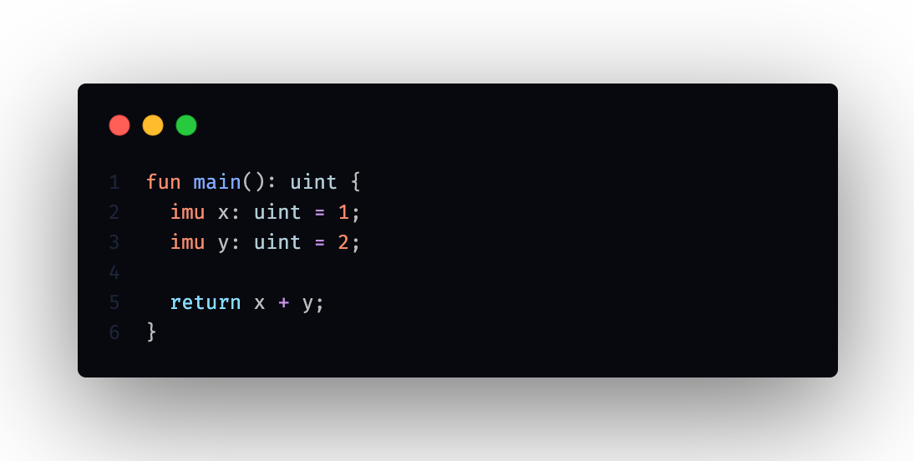
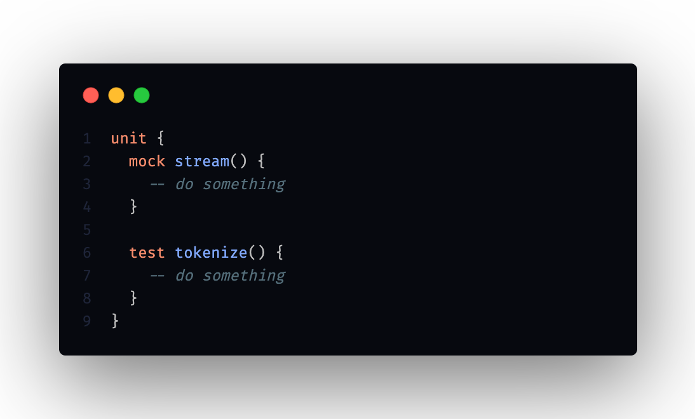

# qhantoom

  

...

## overview

### fresh syntax

qhantoom's syntax is compact, elegant and cames with nice features. keywords are clear, their use is unique, no doubt about the choice of implementation.

  

### embedded unit testing

a good way to do unit tests with functionality adapted to the comfort of the programmer. logic and testing in the same file, to change files as little as possible: *very useful when doing tdd.*

  

## community

if you want to contribute or have questions about the progress of the project, you are welcome to join the [discord](https://discord.gg/5s34BsbH) of the qhantoom galaxy.

## license

[MIT](./LICENSE)
