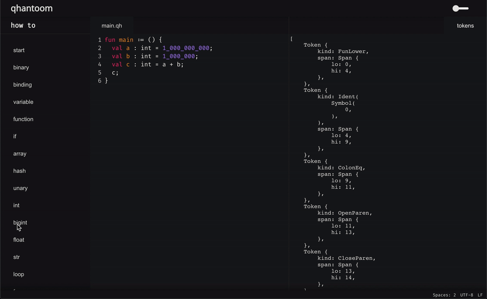

# qhantoom

> *a fresh wind to design safe and optimised applications*

## About

under development | under development | under development 

[roadmap](https://github.com/qhantoom/qhantoom/blob/main/src/doc/roadmap.md) — [syntax](https://github.com/qhantoom/qhantoom/blob/main/src/doc/syntax.md) — [how-to](#) — [lab](#)

## Usage

**fibonacci**

```
fun main := {
  fun fibonacci: (uint) -> Vec<uint> = (n) {
    mut x1 := [1, 1];

    for 2.=n = i {
      val x2 := x1[i - 1] + x1[i - 2];
      x1.push(x2);
    }

    x1
  }

  print(fibonacci(7));
}
```

## Goals

* no gc
* type system
* high performance
* syntax from saturn
* small binaries size
* fast compilation time
* backend | `cranelift`, `llvm`

## Tools

**qhantoom: how-to**

<p align="left">
  <a href="https://qhantoom.dev"></a>
</p>

## Development

[Rust](https://www.rust-lang.org/tools/install) and [Cargo](https://doc.rust-lang.org/cargo/getting-started/installation.html) must be installed on your machine before.

**clone**

```
$ git clone https://github.com/qhantoom/qhantoom.git
```

**build**

```
$ cargo build --release
```

**start**

| run     | cmd                                         |
|---------|---------------------------------------------|
| compile | `cargo run compile <filename>`              |
| repl    | `cargo run repl`                            |
