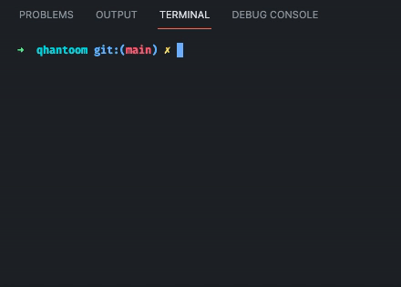

# Design

## Extension File

`.qh`   

## Goals

- no gc
- high performance (fast compilation time)
- hybrid type system
- pretty error handling
- backend `cranelift`, `llvm`, `x86-64` | `aot`, `jit`
- small binaries size
- simple data structures

## Preview

  
  

